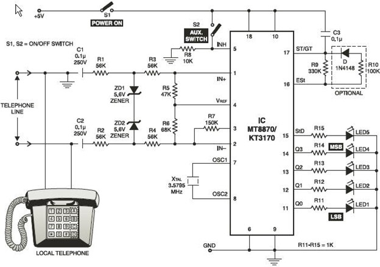

# 📻 AM Transmitter – Analog Audio Broadcast System

This project demonstrates the design and construction of an **AM (Amplitude Modulation) transmitter** capable of broadcasting analog audio signals over radio frequencies. The system uses RF circuits, a modulator, and an antenna system to achieve real-time transmission of audio from a mobile or microphone input.

> 🎓 Second Year Mini Project
> 🏫 MIT Campus, Anna University  
> 📆 January 2024 – April 2024

---

## 🧭 Project Overview

The transmitter modulates a high-frequency carrier wave based on the amplitude of an incoming audio signal. The result is an amplitude-modulated wave that can be received by standard AM radios. This project focuses on circuit-level design, modulation theory, antenna tuning, and real-world testing.

---

## 🔧 Features

- ✅ Real-time AM audio transmission
- 📡 Oscillator circuit for RF carrier generation
- 🎙️ Audio input (mic or mobile)
- 🔊 LED or speaker for demo
- 🧪 Simulation + real hardware testing
- ⚙️ Optional microcontroller integration

---

## ⚙️ Hardware Components

| Component             | Purpose                                  |
|----------------------|------------------------------------------|
| Oscillator Circuit    | Generates carrier wave                   |
| Modulator Circuit     | Combines audio + carrier                 |
| Audio Input Stage     | Processes incoming audio                 |
| Power Amplifier       | Boosts the modulated signal              |
| Antenna System        | Transmits the AM signal                  |
| Power Supply (5V/9V)  | Powers the circuit                       |
| Testing Tools         | Scope, RF meter, frequency counter       |

---

## 💻 Software & Tools Used

- **Proteus / LTSpice / Multisim** (for simulation)
- **KiCad / Eagle** (for PCB design)
- (Optional) **Arduino / MATLAB** if DSP or control added
- **Git** for version control
- **MS Word / LaTeX** for documentation

---

## 📁 Project Structure
```
am-transmitter/
├── AM_Transmitter_Report.pdf # Complete project documentation
├── README.md # Project summary
├── circuit_diagram.jpg # Circuit schematic
```

---

## 📘 Full Report

📄 [View Project Report (PDF)](./AM_Transmitter_Report.pdf)

---

## 📸 Preview

  
*Figure: Oscillator + modulator section of AM transmitter*

---

## 🚀 Applications

- 🎓 Educational demonstrations
- 📡 Community / experimental radio broadcasting
- 🛠️ RF circuit design and testing
- 🔒 Emergency analog communication
- 🎙️ Interactive electronics exhibits

---

## 👨‍💻 Team Members

- **Keerthana** – 2022504024  
- **Yuvaraj** - 2022504554
- **Sham Ganesh** - 2022504023
- **Lokeshwaran** - 2022504057

**Supervisor**: Mrs.G.S.Sivapriya  
Teaching Fellow, Electronics Engineering,  
MIT Campus, Anna University

---

## 📚 References

- [Basic AM Transmitter Circuit – CircuitsToday](https://www.circuitstoday.com/am-transmitter-circuit)
- [RF Oscillator Theory – ElectronicsTutorials](https://www.electronics-tutorials.ws/oscillator/oscillators.html)
- LTSpice / Proteus Simulations

---

## 🛡️ License

This project is shared for educational purposes. Free to use with credit.
